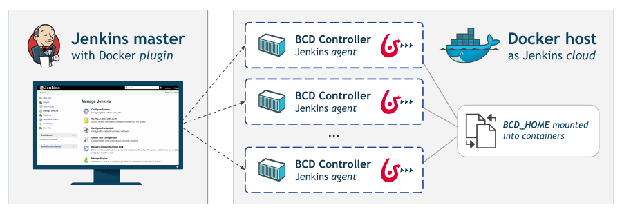
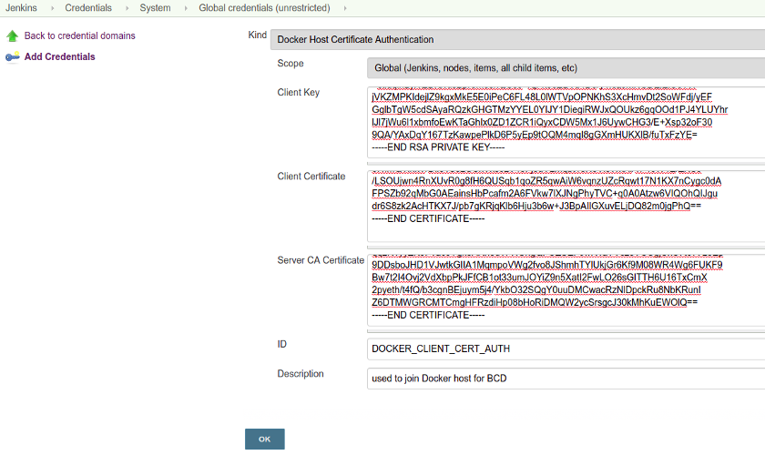
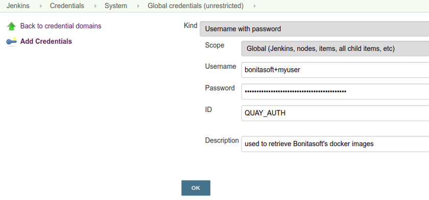
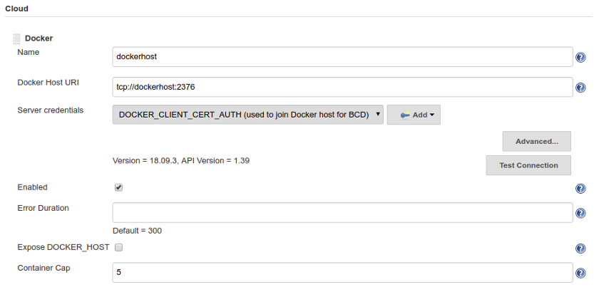
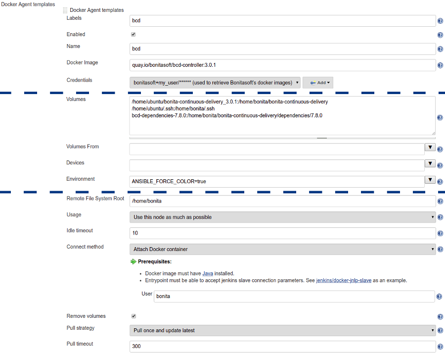

# How to integrate BCD with Jenkins

The BCD controller can not only be run interactively, but also within standard Continuous Delivery servers such as [Jenkins automation server](https://jenkins.io/).

This page describes 2 approaches to using BCD with Jenkins:
- First, a tutorial shows how to set up an **existing Jenkins** platform to start using BCD.
- Second, a **standalone example** lets you start a pre-configured Jenkins server with a BCD-aware Jenkins slave and ready-to-use Jenkins jobs.


## Integration tutorial

There are different ways to run BCD jobs with an existing Jenkins server.  
Here is one recommended setup that requires a Docker host and little changes to your existing Jenkins instance.  
With this setup, the Jenkins master, thanks to the [Jenkins Docker plugin](https://plugins.jenkins.io/docker-plugin), uses the **Docker host** to dynamically provision build agents. On the other hand, the Docker host needs to have the BCD controller image loaded and the `BCD_HOME` directory mounted.



::: warning
This tutorial assumes you are already running a [Jenkins 2](https://jenkins.io/2.0/) instance and that you are familiar with Jenkins system administration.
:::

### Install Docker host

These steps are to be completed on the Docker host.

#### 1. Install Docker and enable remote access

The Docker host needs to run the Docker engine (Community or Enterprise Edition) and can be installed on any [supported platforms](https://docs.docker.com/install/#supported-platforms).  
Besides, the Docker daemon must be accessible remotely on a TCP socket. The [Docker documentation](https://docs.docker.com/engine/reference/commandline/dockerd/#daemon-socket-option) describes how to enable the TCP socket.  
It is also highly recommended to [protect the Docker daemon socket](https://docs.docker.com/engine/security/https/) by enabling the TLS protocol.

#### 2. Install BCD

BCD must be installed on the Docker host which acts here as a **control host**. The installation procedure is described in the [Getting started](getting_started.md) guide.  
The Docker host should now have:
- the `bonitasoft/bcd-controller` Docker image loaded
- the `bonita-continuous-delivery_<version>` directory present
- optionally, the security files for BCD provisioning (SSH key files, AWS credentials)

### Configure Jenkins master

These steps are to be completed on the Jenkins master.

#### 1. Install docker client

Follow the [docker documentation](https://docs.docker.com/install/). For example [on ubuntu](https://docs.docker.com/install/linux/docker-ce/ubuntu/#install-docker-ce-1) you will just need to install `docker-ce-cli` package.

#### 2. Install required plugins

The Jenkins master must have the [Docker plugin](https://plugins.jenkins.io/docker-plugin) installed. The Docker plugin is a "Cloud" implementation that lets you add a new Cloud of type "Docker" on Jenkins master.  
Additionally, it is recommended to use [Pipelines](https://jenkins.io/pipeline/getting-started-pipelines/) while using BCD with Jenkins. You can still use standard Jenkins "freestyle" jobs but pipelines are more designed for continuous delivery. Therefore this requires to install the [Pipeline plugin](https://plugins.jenkins.io/workflow-aggregator) (aka. `workflow-aggregator`).  
This tutorial also provides an example pipeline which requires the [Pipeline Utility Steps](https://plugins.jenkins.io/pipeline-utility-steps), [Pipeline: GitHub Groovy Libraries](https://plugins.jenkins.io/pipeline-github-lib) and [AnsiColor](https://plugins.jenkins.io/ansicolor) plugins to be installed.

::: info
The [Jenkins plugins documentation](https://jenkins.io/doc/book/managing/plugins/#installing-a-plugin) describes different methods for installing plugins on master.
:::

#### 3. Add Docker Host credentials

As recommended previously, the Docker host should have TLS enabled. Therefore, the Docker host credentials must be added to Jenkins master.  
Follow the [Jenkins credentials documentation](https://jenkins.io/doc/book/using/using-credentials/#adding-new-global-credentials) to add new **Docker Host Certificate Authentication** credentials. These credentials are required to declare a secured Docker cloud in the next step.

::: danger
If your Docker TCP socket is not secured, then you can skip this step. But bear in mind that exposing the Docker TCP socket without TLS is really **not safe**.
:::



In addition you will have to add a new **Username with password** credentials to configure quay.io access.



#### 4. Add a new Cloud

This step instructs Jenkins master to add a new _Cloud_ of type Docker in order to provision build agents for BCD jobs.

Follow these steps to add a Docker cloud:
* Edit Jenkins system configuration (**Jenkins > Manage Jenkins > Configure System**) and **Add a new cloud** of type _Docker_.
* Give it a **Name** and a **Docker Host URI** like `tcp://dockerhost:2376` (where `dockerhost` is the hostname or IP of the Docker host).  
  _It is conventional to use port `2376` when TLS is enabled, and port `2375` for un-encrypted communication with the Docker daemon._
* With a secured Docker TCP socket, select the **Server credentials** created previously. Otherwise, select _None_.
* Click on **Test Connection** to confirm your configuration is correct.



#### 5. Add Docker template

A Docker template must be added to define how to start Jenkins build agents as BCD controller containers.

Click on **Add Docker template** to add a Docker template in the Docker cloud and filling in the fields as follows:
* **Labels**: `bcd`
* **Enabled**: `[checked]`
* **Name**: `bcd`
* **Docker Image**: `quay.io/bonitasoft/bcd-controller:3.0.1` (where 3.0.1 is the version of BCD to use)
* **Volumes**:
  ```
  /home/dockeruser/bonita-continuous-delivery_3.0.1:/home/bonita/bonita-continuous-delivery
  /home/dockeruser/.ssh:/home/bonita/.ssh
  bcd-dependencies-7.8.0:/home/bonita/bonita-continuous-delivery/dependencies/7.8.0
  ```
* **Environment**: `ANSIBLE_FORCE_COLOR=true` (this forces colored output in BCD logs)
* **Remote File System Root**: `/home/bonita`
* **Connect method**: `Attach Docker container` - **User**: `bonita`



::: info
Jenkins is now ready to run BCD Pipelines. An example scripted pipeline is provided in the next section.
:::

### Create a Pipeline job

Create a **Pipeline** item with a `BCD_SCENARIO` String parameter which sets the BCD scenario path as an environment variable.  
For instance, the `BCD_SCENARIO` parameter can be set to `scenarios/build_and_deploy.yml`.  
Then here is an example pipeline script that builds a LivingApp repository and deploys its artifacts on an already running Bonita platform:
```
@Library('github.com/bonitasoft/bonita-jenkins-library@1.0.0') _

node('master') {
    stage('Retrieve dependencies') {
        docker.withServer('tcp://dockerhost:2376', 'DOCKER_CLIENT_CERT_AUTH') {
            docker.withRegistry('https://quay.io', 'QUAY_AUTH') {
                docker.image('quay.io/bonitasoft/bcd-dependencies:7.8.0').withRun('-v bcd-dependencies-7.8.0:/dependencies') {
                }
            }
        }
    }
}

node('bcd') {
    ansiColor('xterm') {

        stage('Git Ckeckout') {
            git url: 'https://github.com/bonitasoft/bonita-vacation-management-example',
            branch: 'dev/7.8.0'
        }
        
        stage('build-bonita-app') {
            bcd args: "livingapp build -p ${WORKSPACE} -e Test"
        }
        
        def jobBaseName = "${env.JOB_NAME}".split('/').last()
        
        stage('deploy-bonita-app') {
            def zip_files = findFiles(glob: "target/${jobBaseName}-*.zip")
            def bconf_files = findFiles(glob: "target/${jobBaseName}-*.bconf")
            if( bconf_files!= null && bconf_files.length >0 )
                bcd args: "livingapp deploy -p ${WORKSPACE}/${zip_files[0].path} -c ${WORKSPACE}/${bconf_files[0].path}"
            else
                bcd args: "livingapp deploy -p ${WORKSPACE}/${zip_files[0].path}"
        }
        
        stage('archive-artifacts') {
            archiveArtifacts artifacts: "target/${jobBaseName}/**/*.*, target/${jobBaseName}-*.*, .bcd_configurations/*.yml", fingerprint: true
        }
     
    }
}
```

This pipeline uses a Jenkins shared library [hosted on GitHub](https://github.com/bonitasoft/bonita-jenkins-library).  
This scripted pipeline can also be used in a [Jenkinsfile](https://jenkins.io/doc/book/pipeline/jenkinsfile/) and it can be checked into your LivingApp repository.


## Standalone example

The `bonita-continuous-delivery_<version>.zip` archive also provides a `jenkins-example` directory which contains a minimal working example of a Continuous Delivery platform with Jenkins and BCD. This example will start a pre-configured Jenkins server with a BCD-aware Jenkins slave and ready-to-use Jenkins jobs.  

It is provided as a [Docker Compose](https://docs.docker.com/compose/) project.

Therefore you should have **Docker and Docker Compose** installed on the target host to run this example.

This example is provided with Compose file version 3.2 which requires Docker Compose 1.12.0+ and Docker Engine 17.04.0+. Refer to [Compose and Docker compatibility matrix](https://docs.docker.com/compose/compose-file/#compose-and-docker-compatibility-matrix) and [Compose release notes](https://docs.docker.com/release-notes/docker-compose/) for further details.

::: info
In this example, a Jenkins slave is created from a Docker image which extends the BCD Controller image. Then an example job is defined as a [Jenkins Pipeline](https://jenkins.io/doc/book/pipeline/) job in which `bcd` commands are invoked.  
This allows you to easily re-use parts of this example in your own Jenkins instance.
:::

### Step-by-step run guide

Here is a step-by-step guide to run this example.  
The following commands are to be executed on the target host where Jenkins is to be installed.

1.  Configure the Docker Compose project.
    *   Rename the `docker-compose.override.yml.EXAMPLE` file to `docker-compose.override.yml` (remove the `.EXAMPLE` extension).
    *   Configure `environment` and `volumes` sections and save.
2.  Configure initial secrets used by Jenkins and BCD.
    *   Rename the `secrets/*Password.EXAMPLE` files to `secrets/*Password` (remove the `.EXAMPLE` extension).  
        With most Linux distributions, you can do this with the `rename` command line tool as follows: `rename 's/.EXAMPLE//' *.EXAMPLE`).
    *   Configure each `*Password` file with appropriate credentials.
3.  Make sure the BCD Controller Docker image is loaded as described in the installation section of the [BCD controller Docker image](bcd_controller.md) page.
4.  Create and start containers with Docker Compose.
    ```
    $ cd jenkins_example
    $ docker-compose up -d
    ```

As a result Jenkins is up and running on port `9090` of the target host.  
You can now log-in to Jenkins using one of the pre-configured users:

*   `admin` - User with administration rights. Password has been initialized with `secrets/adminPassword`.
*   `bonita` - User with limited rights. Password has been initialized with `secrets/bonitaPassword`.

::: warning
**Important Note**: Prepare your BCD scenario and dependencies as usual before using the pre-configured Jenkins jobs.
:::

### Pre-configured Jenkins jobs

Once authenticated to Jenkins you can now launch pre-configured jobs.  
This example project provides the following jobs:

*   `bcd-pipeline` - this job shows how the BCD CLI can be used to build a Continuous Delivery pipeline for a Bonita Living Application.
*   `bcd-undeploy` - this job allows to undeploy a Bonita stack (by removing Docker containers) and if needed it can also destroy AWS EC2 machines when using BCD with AWS cloud provider.
